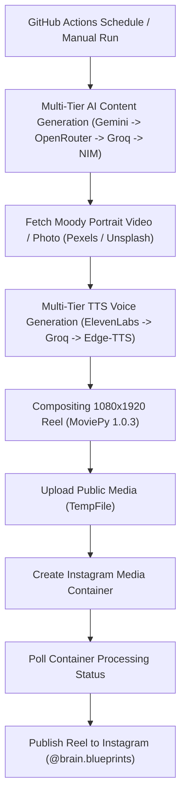

# 🧠 Brain Blueprints Automation Engine v6.0 🧠

A high-engagement, retention-focused, fully automated psychological tactics and behavioral analysis publishing studio.

Python | GitHub Actions | Multi-AI Failover | Pexels | Unsplash | ElevenLabs | Instagram Graph API

---

## ⚡ Generate. Design. Host. Publish. Repeat.

Turn a GitHub repository into an autonomous studio that runs 100% on cloud and local APIs to curate dark psychology insights, fetch moody aesthetic stock media, synthesize multi-tier voiceovers, edit 100% looping Reels, and publish directly to Instagram.

---

## 🌙 What Makes Version 6.0 Different?

Unlike static text-posting scripts, this bot builds high-retention Instagram Reels designed for viral algorithmic loops, shares, and saves:

| Layer | Technology | Function |
| :--- | :--- | :--- |
| **🧠 Content Brain** | Multi-Tier AI Chain (Gemini 3.5 Flash → OpenRouter → Groq → NVIDIA NIM) | Generates punchy social tactics, behavioral triggers, and seamless audio-loop scripts. |
| **🖼️ Media Engine** | Pexels + Unsplash API | Fetches aesthetic vertical portrait stock videos and dark moody photography. |
| **🎬 Reel Studio** | MoviePy 1.0.3 + NumPy | Composites 1080x1920 vertical motion video clips with timed text overlays and zero-latency cuts. |
| **🎙️ Voice Layer** | Multi-Tier TTS (ElevenLabs → Groq TTS → Edge-TTS) | Synthesizes realistic, cinematic voice narration for high-retention viewing. |
| **🔄 Cross-Fallback** | 5-Tier Resilient Architecture | Automatically cycles through AI and TTS providers instantly if any API rate-limit or 503 error occurs. |
| **☁️ Media Bridge** | TempFile (tempfile.org) | Serves temporary public URLs for Instagram Graph API ingestion. |
| **📡 Publisher** | Instagram Graph API | Automates container creation, video processing status polling, and direct publishing. |
| **🕰️ Scheduler** | GitHub Actions | Runs completely hands-free 3 times a day via cron. |

---

## 🧩 System Blueprint


## 📂 Repository Layout
```text
.
├── .github/workflows/main.yml  # GitHub Actions cron schedules and environment runner setup
├── poster.py                   # The core multi-tier AI and video rendering engine
├── requirements.txt            # Python dependencies (Pinned MoviePy 1.0.3 & OpenAI bridge)
├── LICENSE                     # Attribution-Required License
└── README.md                   # System documentation

```
## 🚀 Quick Start Setup
### 1. Clone or Fork
```bash
git clone YOUR_REPO_URL
cd brain.blueprints-autobot

```
### 2. Configure GitHub Secrets
Go to your repository: **Settings → Secrets and variables → Actions → New repository secret**
| Secret Name | Required | Description |
|---|---|---|
| GEMINI_API_KEY | ✅ (Tier 1) | Free API key from Google AI Studio. |
| OPENROUTER_API_KEY | ✅ (Tier 2) | Free API key from OpenRouter.ai. |
| GROQ_API_KEY | ✅ (Tier 3) | Free API key from Groq Console. |
| NVIDIA_API_KEY | ✅ (Tier 4) | Free API key from NVIDIA NIM (nvapi-...). |
| ELEVENLABS_API_KEY | ✅ (TTS 1) | ElevenLabs API key for cinematic voiceovers. |
| INSTAGRAM_ACCESS_TOKEN | ✅ | Meta Graph API long-lived access token. |
| INSTAGRAM_USER_ID | ✅ | Connected Instagram Creator / Business ID. |
| PEXELS_API_KEY | ✅ | Free API key from Pexels Developer Portal. |
| UNSPLASH_ACCESS_KEY | ✅ | Free Access Key from Unsplash Developer Portal. |
## 🕰️ Automated Schedule
The bot posts **3 times daily** automatically via GitHub Actions crons:
 * 0 2,10,18 * * * (Optimized intervals for global reach)
## 🧪 Local Testing
### PowerShell (Windows):
```powershell
$env:GEMINI_API_KEY="your_key"
$env:OPENROUTER_API_KEY="your_key"
$env:GROQ_API_KEY="your_key"
$env:NVIDIA_API_KEY="your_key"
$env:ELEVENLABS_API_KEY="your_key"
$env:INSTAGRAM_ACCESS_TOKEN="your_token"
$env:INSTAGRAM_USER_ID="your_user_id"
$env:PEXELS_API_KEY="your_pexels_key"
$env:UNSPLASH_ACCESS_KEY="your_unsplash_key"
python -u poster.py

```
### Bash (Linux / macOS):
```bash
export GEMINI_API_KEY="your_key"
export OPENROUTER_API_KEY="your_key"
export GROQ_API_KEY="your_key"
export NVIDIA_API_KEY="your_key"
export ELEVENLABS_API_KEY="your_key"
export INSTAGRAM_ACCESS_TOKEN="your_token"
export INSTAGRAM_USER_ID="your_user_id"
export PEXELS_API_KEY="your_pexels_key"
export UNSPLASH_ACCESS_KEY="your_unsplash_key"
python -u poster.py

```
## 🧾 License
This project is licensed under the Attribution Required License. See the terms in the LICENSE file.
*Built for people who want psychology, automation, and aesthetics in the same room.*
```