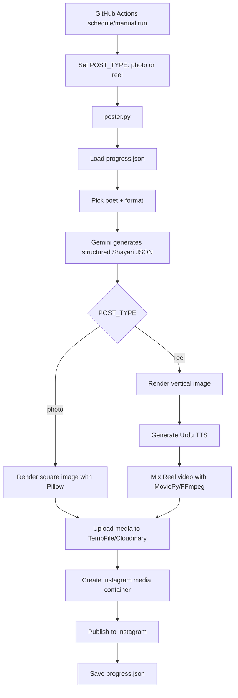

<div align="center">

# ✦ Instagram Shayari Bot ✦

### A cinematic, fully automated poetry-posting engine for Instagram.


**Generate. Design. Host. Publish. Repeat.**

Turn a GitHub repository into a tiny publishing studio that wakes up twice a day, writes Shayari, designs a post, creates a Reel, and publishes to Instagram.

</div>

---

## 🌙 What Makes This Different

Most automation scripts just post a file. This one behaves more like a small creative system:

| Layer | What It Does |
|---|---|
| 🧠 Content Brain | Uses Gemini to generate structured Shayari metadata, not just plain text. |
| 🎨 Visual Engine | Builds 1080x1080 posts and 1080x1920 Reel frames with Pillow. |
| 🎙️ Voice Layer | Uses Urdu Edge TTS for Reel narration. |
| 🎞️ Reel Studio | Mixes image, voiceover, and background music into an MP4. |
| ☁️ Media Bridge | Uploads generated media to a public host Instagram can fetch. |
| 📡 Publisher | Uses Instagram Graph API to create and publish media containers. |
| 🕰️ Scheduler | Runs automatically with GitHub Actions. |
| 🧾 Memory | Tracks progress so the same day's photo and Reel share the same Shayari. |

---

## ✨ Feature Map

- 📸 Scheduled Instagram photo posts.
- 🎬 Scheduled Instagram Reels.
- 🧠 Gemini-powered Shayari generation.
- 🪶 Roman text, Urdu text, English translation, captions, hashtags, emotion, source, and color hints.
- 🖼️ Square 1080x1080 image generation.
- 📱 Vertical 1080x1920 Reel image generation.
- 🎙️ Urdu voiceover with Edge TTS.
- 🎵 Background music mixing from the `music/` folder.
- ☁️ TempFile.org media hosting by default.
- 🧱 Optional Cloudinary support for durable hosted media.
- ⛔ Bounded retries and workflow timeout so failures finish clearly.
- 🧭 Progress tracking to avoid duplicate same-day posts.

---

## 🧩 System Blueprint



---

## 📂 Repository Layout

```text
.
|-- .github/workflows/main.yml  # automation schedule and runtime
|-- music/                      # background MP3 files for Reels
|-- poster.py                   # the bot brain
|-- progress.json               # posting state and duplicate guard
|-- requirements.txt            # Python dependencies
|-- CONTEXT.md                  # maintainer/debugging handbook
|-- LICENSE                     # attribution-required license
`-- README.md                   # this guide
```

---

## 🚀 Quick Start

### 1. Fork Or Clone

Use this repository as your starting point.

```bash
git clone YOUR_REPO_URL
cd shayari-bot
```

### 2. Install Locally

```bash
pip install -r requirements.txt
```

### 3. Add Your Secrets

In GitHub, open:

`Settings` → `Secrets and variables` → `Actions`

Add:

| Secret | Required | Purpose |
|---|---:|---|
| `GEMINI_API_KEY` | ✅ | Generates Shayari content. |
| `INSTAGRAM_ACCESS_TOKEN` | ✅ | Publishes through Instagram Graph API. |
| `INSTAGRAM_USER_ID` | ✅ | Identifies your Instagram account. |
| `CLOUDINARY_URL` | Optional | Use only if `MEDIA_HOST=cloudinary`. |
| `CATBOX_USERHASH` | Optional | Use only if `MEDIA_HOST=catbox`. |

### 4. Run The Workflow

Go to GitHub:

`Actions` → `Daily Shayari Post` → `Run workflow`

Choose:

- `photo`
- `reel`

---

## 🔑 Create The Instagram OAuth Token

You need an Instagram Business or Creator account connected to a Meta app.

1. Go to https://developers.facebook.com/apps/.
2. Create or open your Meta app.
3. Add Instagram API / Instagram Business Login setup.
4. Connect your Instagram account.
5. Go to `Instagram` → `API setup with Instagram business login`.
6. Click `Generate token`.
7. Approve permissions.
8. Copy only the token string.
9. Add it to GitHub as `INSTAGRAM_ACCESS_TOKEN`.

Verify it:

```bash
curl "https://graph.instagram.com/me?fields=id,username&access_token=YOUR_TOKEN"
```

You should see your Instagram `id` and `username`.

> Tokens usually need renewal about every 60 days. When auth fails, regenerate the token and update the GitHub secret.

---

## 🧠 Create The Gemini API Key

1. Open Google AI Studio.
2. Create a Gemini API key.
3. Add it to GitHub Actions secrets as `GEMINI_API_KEY`.

The bot uses Gemini to return structured JSON with:

- Shayari in Roman text.
- Shayari in Urdu script for TTS.
- English translation.
- Caption.
- Emotion.
- Source.
- Suggested colors.
- Hashtags.

---

## ☁️ Media Hosting Options

Instagram does not accept a local image or MP4 file directly. It needs a public HTTPS URL that Meta can fetch.

| Host | Best For | Secret Needed | Notes |
|---|---|---:|---|
| `tempfile` | Simple setup | No | Default. Temporary URLs, good for immediate publishing. |
| `cloudinary` | Production durability | Yes | Recommended if you want stable CDN URLs. |
| `catbox` | Manual fallback | Optional | Supported, but anonymous uploads previously failed with `Invalid uploader`. |

Current workflow value:

```yaml
MEDIA_HOST: tempfile
```

To switch to Cloudinary:

1. Create a Cloudinary account.
2. Copy your `CLOUDINARY_URL`.
3. Add it as a GitHub Actions secret.
4. Change workflow env:

```yaml
MEDIA_HOST: cloudinary
```

---

## 🕰️ Automation Schedule

The workflow runs twice a day:

```yaml
- cron: '30 2 * * *'   # photo, about 8:00 AM IST
- cron: '30 13 * * *'  # reel, about 7:00 PM IST
```

The workflow also supports manual runs with a dropdown:

```yaml
post_type:
  options:
    - photo
    - reel
```

---

## 🎨 Make It Yours

This is where the fun starts.

### Change The Instagram Handle

```python
IG_HANDLE = "@your_handle"
```

### Change The Poet List

```python
POET_SCHEDULE = [
    {"name": "Mirza Ghalib", "era": "1797-1869"},
    {"name": "Faiz Ahmed Faiz", "era": "1911-1984"},
]
```

### Change Content Formats

```python
FORMAT_WEIGHTS = [
    ("four-liner", 40),
    ("longer", 35),
    ("couplet", 20),
    ("one-liner", 5),
]
```

### Change The Visual Mood

```python
EMOTION_PALETTES = {
    "ishq": {
        "bg": "#1a0010",
        "text": "#f5c6d0",
        "accent": "#e8587a",
    },
}
```

### Change The AI Voice

Edit `generate_tts` in `poster.py`.

Current voice:

```python
VOICE = "ur-PK-AsadNeural"
```

### Change The Generation Style

Edit the prompt inside:

```python
generate_content(poet, fmt)
```

You can make it:

- More classical.
- More modern.
- More romantic.
- More minimal.
- More educational.
- More brand-specific.

---

## 🧪 Local Test

Windows PowerShell:

```powershell
$env:GEMINI_API_KEY="your_key"
$env:INSTAGRAM_ACCESS_TOKEN="your_token"
$env:INSTAGRAM_USER_ID="your_user_id"
$env:POST_TYPE="photo"
$env:MEDIA_HOST="tempfile"
python poster.py
```

Linux/macOS:

```bash
export GEMINI_API_KEY="your_key"
export INSTAGRAM_ACCESS_TOKEN="your_token"
export INSTAGRAM_USER_ID="your_user_id"
export POST_TYPE="photo"
export MEDIA_HOST="tempfile"
python poster.py
```

---

## 🛠️ Troubleshooting

### ❌ Invalid OAuth access token

Example:

```text
Invalid OAuth access token - Cannot parse access token
```

Fix:

1. Regenerate the token in Meta Developers.
2. Copy only the token string.
3. Update `INSTAGRAM_ACCESS_TOKEN` in GitHub Actions secrets.
4. Re-run the workflow.

### ❌ Media could not be fetched

Instagram could not download your image/video URL.

Fix:

1. Open the logged media URL in a private browser window.
2. Confirm it opens without login.
3. Switch to `MEDIA_HOST=cloudinary` if temporary hosting is unreliable.

### ❌ Catbox invalid uploader

Catbox rejected the upload.

Fix:

- Keep `MEDIA_HOST=tempfile`.
- Or switch to `MEDIA_HOST=cloudinary`.

### ❌ Gemini returns malformed JSON

Fix:

1. Re-run once.
2. Tighten the prompt in `generate_content`.
3. Add stronger schema validation if it repeats.

### ❌ Reel generation fails

Possible causes:

- TTS service issue.
- MoviePy failure.
- FFmpeg failure.
- Broken or oversized audio file.

The script attempts a silent FFmpeg Reel fallback when TTS fails.

---

## 🧾 License

This project uses a custom attribution-required license.

You may use, copy, modify, and distribute this project, but you must give visible credit to:

**Areeb Khan**

See [LICENSE](LICENSE) for the full terms.

---

<div align="center">

### Built for people who want poetry, automation, and aesthetics in the same room.

**If this project helps you build your own Instagram poetry engine, credit Areeb Khan.**

</div>
