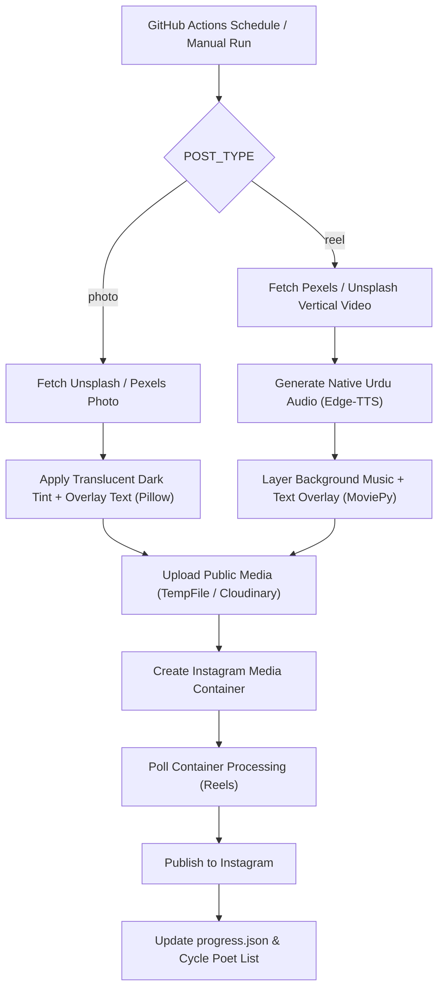

<div align="center">

# ✦ Instagram Shayari Bot v5.5 ✦

### A cinematic, retention-focused, fully automated poetry publishing engine.


**Generate. Design. Host. Publish. Repeat.**

Turn a GitHub repository into an autonomous publishing studio that runs 100% on free APIs to curate poetry, fetch aesthetic stock media, synthesize voiceovers, edit Reels, and publish directly to Instagram.

</div>

---

## 🌙 What Makes Version 5.5 Different

Unlike simple text-posting scripts, this bot builds high-retention Instagram media designed for maximum reach, shares, and saves:

| Layer | Technology | Function |
|---|---|---|
| 🧠 **Content Brain** | Gemini 2.5 Flash | Generates authentic Shayari, Roman Urdu, Urdu script, English translations, and visual search terms. |
| 🖼️ **Photo Engine** | Unsplash + Pexels API | Fetches aesthetic high-res photography with translucent dark overlays for legibility. |
| 🎬 **Reel Studio** | Pexels + Unsplash + MoviePy | Composites 4K vertical motion video clips with timed text overlays and background music. |
| 🎙️ **Voice Layer** | Edge-TTS (`ur-PK-AsadNeural`) | Synthesizes realistic Urdu pronunciation for video narration. |
| 🔄 **Cross-Fallback** | Dual-Engine Architecture | Automatically fails over between Unsplash and Pexels if any API limit or network error occurs. |
| ☁️ **Media Bridge** | TempFile / Cloudinary | Serves temporary or permanent public URLs for Instagram Graph API ingestion. |
| 📡 **Publisher** | Instagram Graph API | Automates container creation, video processing status polling, and direct publishing. |
| 🕰️ **Scheduler** | GitHub Actions | Runs completely hands-free on daily crons. |

---

## 🧩 System Blueprint


## 📂 Repository Layout
```text
.
├── .github/workflows/main.yml  # GitHub Actions schedule and environment setup
├── music/                      # Royalty-free instrumental MP3 tracks for Reels
├── poster.py                   # The core bot engine
├── progress.json               # Posting state tracking
├── requirements.txt            # Python dependencies
├── LICENSE                     # Attribution-Required License
└── README.md                   # System documentation

```
## 🚀 Quick Start Setup
### 1. Clone or Fork
```bash
git clone YOUR_REPO_URL
cd shayari-bot

```
### 2. Configure GitHub Secrets
Go to your repository:
Settings → Secrets and variables → Actions → New repository secret
| Secret Name | Required | Description |
|---|---|---|
| GEMINI_API_KEY | ✅ | Free API key from Google AI Studio. |
| INSTAGRAM_ACCESS_TOKEN | ✅ | Meta Graph API long-lived access token. |
| INSTAGRAM_USER_ID | ✅ | Connected Instagram Creator / Business ID. |
| PEXELS_API_KEY | ✅ | Free API key from Pexels Developer Portal. |
| UNSPLASH_ACCESS_KEY | ✅ | Free Access Key from Unsplash Developer Portal. |
| CLOUDINARY_URL | Optional | Required only if MEDIA_HOST=cloudinary. |
## 🕰️ Automated Schedule
The bot posts twice daily via GitHub Actions:
```yaml
- cron: '30 2 * * *'   # 8:00 AM IST - Static Photo
- cron: '30 13 * * *'  # 7:00 PM IST - Motion Reel

```
## 🧪 Local Testing
PowerShell (Windows):
```powershell
$env:GEMINI_API_KEY="your_key"
$env:INSTAGRAM_ACCESS_TOKEN="your_token"
$env:INSTAGRAM_USER_ID="your_user_id"
$env:PEXELS_API_KEY="your_pexels_key"
$env:UNSPLASH_ACCESS_KEY="your_unsplash_key"
$env:POST_TYPE="photo"
python -u poster.py

```
Bash (Linux / macOS):
```bash
export GEMINI_API_KEY="your_key"
export INSTAGRAM_ACCESS_TOKEN="your_token"
export INSTAGRAM_USER_ID="your_user_id"
export PEXELS_API_KEY="your_pexels_key"
export UNSPLASH_ACCESS_KEY="your_unsplash_key"
export POST_TYPE="photo"
python -u poster.py

```
---

## 🧾 License

This project is licensed under the **Attribution Required License**. See the full terms in the [LICENSE](LICENSE) file.

> **Attribution Requirement**  
> You are free to copy, modify, and distribute this software for personal or commercial automation, but visible credit to **Areeb Khan** is strictly required in derivative works or documentations.

---

<div align="center">

*Built for people who want poetry, automation, and aesthetics in the same room.*

</div>

