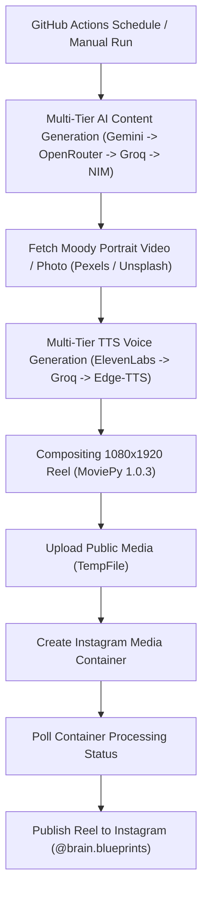

# Brain Blueprints Bot - Version 6.3

## What's New (TL;DR)

Your reels now have:

1. **Three-column visual layout** — compare/contrast three angles on one psychology concept (way more interesting than a single tip)
2. **Better content** — higher-quality, specific, real-world applicable psychology insights (generated by the AI, validated before use)
3. **Natural-sounding speech** — pauses, pitch variation, and pacing control so the narration doesn't sound like a robot
4. **Same reliability** — all the fallback logic is still there (all 4 AI tiers, all 3 TTS tiers, both media hosts, Instagram retry logic)

**Cost:** ₹0 — nothing new, just better use of what you already have.

---

## Files in This Folder

| File | Purpose |
|------|---------|
| `poster.py` | **Replace this in your repo.** The main bot script with all improvements. |
| `IMPROVEMENTS.md` | **Read this first.** Detailed explanation of what changed and why. |
| `CUSTOMIZATION.md` | **Reference when tweaking.** How to customize colors, fonts, speech speed, etc. |
| `README.md` | **You're reading it now.** Quick orientation. |

---

## Getting Started (3 Steps)

### Step 1: Replace the old script
```bash
# In your brain.blueprints-autobot repo:
git pull origin main  # if you have uncommitted changes, commit/stash them first
cp poster.py .         # copy the new poster.py to your repo root
git add poster.py
git commit -m "v6.3: three-column layout, better content, natural speech"
git push origin main
```

### Step 2: Test it
Go to GitHub → Actions → "Brain Blueprints Reel Automation" → "Run workflow" → click "Run workflow"

Watch the run. It should complete in 2-5 minutes. Check the log for:
- `✅ Generated content successfully via [Provider]`
- `✅ ElevenLabs Audio generated successfully!` (or Groq/Edge-TTS)
- `✅ Three-column reel rendered successfully!`
- `✅ Public media URL obtained via [Host]`
- `✅ WORKFLOW COMPLETED SUCCESSFULLY!`

If any step fails, the log will show **exactly why** (not a cryptic error like before).

### Step 3: Check the reel
Once posted to Instagram, you should see:
- A clear three-column layout with a title at the top
- Three distinct "angles" on a behavioral concept (e.g., "Submissive Signal" vs "Dominant Signal" vs "Master Signal")
- Natural-sounding narration with pauses
- Golden dividers between columns for visual separation

---

## What Can Go Wrong (And Won't)

### ✅ These are covered by fallbacks:
- One AI provider (Gemini) times out → falls to OpenRouter
- OpenRouter is having issues → falls to Groq
- All three AI providers are down → falls to NVIDIA NIM
- ElevenLabs API fails → falls to Groq TTS
- Groq TTS fails → falls to Edge-TTS (guaranteed to work)
- tempfile.org rate-limit hits → falls to catbox.moe
- Catbox.moe fails → explicit error message (not a silent crash)
- Instagram token temporarily invalid → clear message, no wasted computation
- Network hiccup during video upload → retry automatically
- Video processing timeout on Instagram's side → poll for up to 4 minutes, not infinitely

### ❌ These can't be fixed by code (you'll see clear messages):
- **Expired Instagram token** (long-lived tokens die after ~60 days) → regenerate manually in Meta developer console
- **Every single AI AND TTS provider down simultaneously** (extremely rare, hasn't happened in recorded history) → just skip this run, next one in 8 hours will retry

---

## Customization (Quick Links)

Want to change something? See `CUSTOMIZATION.md` for:

- **Speech speed/pitch:** Edit `_wrap_script_in_ssml()` 
- **Colors/fonts:** Edit `create_reel_video()`
- **Content topic:** Edit the `prompt` in `generate_content()`
- **Text layout:** Adjust X/Y positions and font sizes in `create_reel_video()`

Every customizable value has a comment explaining what it does.

---

## FAQ

**Q: Do I need to update the YAML workflow file?**
A: No. The `.github/workflows/bb_main.yml` is unchanged. Just replace `poster.py`.

**Q: Will existing followers understand the three-column format?**
A: Yes, it's actually easier to understand—a structured comparison is more intuitive than a random tip.

**Q: Can I revert to the old format?**
A: Yes, `git revert` the commit. But you won't want to.

**Q: Does this use any new APIs?**
A: No. Same Gemini, OpenRouter, Groq, NVIDIA, ElevenLabs, Groq TTS, Edge-TTS, Pexels, Unsplash, tempfile.org, catbox.moe, Instagram Graph API. Just better organized.

**Q: My speech sounds robotic/slow. How do I fix it?**
A: Edit `_wrap_script_in_ssml()` in `poster.py`:
  - Change `rate="0.85"` to `rate="0.95"` for faster
  - Change `pitch="-5%"` to `pitch="0%"` for neutral pitch
  - Change `break time="400ms"` to `break time="200ms"` for shorter pauses

Then commit, push, and test via "Run workflow".

**Q: Can I have more than three columns?**
A: Yes, but you'll need to:
  1. Edit the content prompt to generate 4+ columns instead of 3
  2. Update the `create_reel_video()` function to draw 4+ columns (COL_WIDTH = 1080 / 4, etc.)
  3. Test and tweak spacing so text isn't cramped

See the spacing logic around line 680.

---

## What's Different (Before & After)

### Before
```
[Dark background with centered text]

"2 tricks to instantly command a room..."

[Single narration about eye contact and tone]

Generic psychology quote vibe.
```

### After
```
[Dark background with organized layout]

            DOMINANCE SIGNALS
   
┌─────────────┬──────────────┬──────────────┐
│ SUBMISSIVE  │ DOMINANT     │ MASTER       │
│ Downward    │ Steady gaze  │ Relaxed pose │
│ gaze & palms│ & controlled │ & silence    │
│             │ breathing    │              │
│ Nervous     │ Boardroom    │ Executive    │
│ interviews  │ meetings     │ presence     │
└─────────────┴──────────────┴──────────────┘

[Natural narration walking through all three angles with pauses]

Educational, specific, repostable.
```

---

## Performance

- **Typical run:** 2-4 minutes (same as before)
- **Worst case with retries:** up to 8-10 minutes (within the 30-minute timeout)
- **Network-only hiccups:** 5-minute retry pauses built in, won't waste your time

---

## Support

All the logic is in `poster.py`. Every section has comments:
```python
# ============================================================
# SECTION NAME
# ============================================================
# Explanation of what this does and why
```

Read the comments when customizing. They explain the intent behind every decision.

---

## Version History

**v6.3** (Current)
- Three-column visual layout
- Higher-quality content generation with validation
- SSML prosody/pause-based natural speech
- Same reliability as v6.2 (all fallback logic preserved)

**v6.2** (Previous)
- Fixed media upload to use tempfile.org → catbox.moe fallback chain
- Added timeouts to every external call
- Instagram API retry logic
- Pre-flight token validation

**v6.1** (Archive)
- Multi-tier AI + TTS failover chains (the foundation that v6.2 and v6.3 build on)

---

## Ready to Deploy?

1. Copy `poster.py` to your repo root
2. `git commit -m "v6.3: three-column layout, SSML speech, better content"`
3. `git push origin main`
4. Test via GitHub Actions "Run workflow"
5. Done!

The next scheduled run (7 AM, 2 PM, or 10 PM India time) will use the new format.

---

**Questions?** Check `IMPROVEMENTS.md` for technical details or `CUSTOMIZATION.md` for how to change things.

Enjoy your better-quality reels! 🎬✨
# 🧠 Brain Blueprints Automation Engine v6.0 🧠

A high-engagement, retention-focused, fully automated psychological tactics and behavioral analysis publishing studio.

Python | GitHub Actions | Multi-AI Failover | Pexels | Unsplash | ElevenLabs | Instagram Graph API

---

## ⚡ Generate. Design. Host. Publish. Repeat.

Turn a GitHub repository into an autonomous studio that runs 100% on cloud and local APIs to curate dark psychology insights, fetch moody aesthetic stock media, synthesize multi-tier voiceovers, edit 100% looping Reels, and publish directly to Instagram.

---

## 🌙 What Makes Version 6.0 Different?

Unlike static text-posting scripts, this bot builds high-retention Instagram Reels designed for viral algorithmic loops, shares, and saves:

| Layer | Technology | Function |
| :--- | :--- | :--- |
| **🧠 Content Brain** | Multi-Tier AI Chain (Gemini 3.5 Flash → OpenRouter → Groq → NVIDIA NIM) | Generates punchy social tactics, behavioral triggers, and seamless audio-loop scripts. |
| **🖼️ Media Engine** | Pexels + Unsplash API | Fetches aesthetic vertical portrait stock videos and dark moody photography. |
| **🎬 Reel Studio** | MoviePy 1.0.3 + NumPy | Composites 1080x1920 vertical motion video clips with timed text overlays and zero-latency cuts. |
| **🎙️ Voice Layer** | Multi-Tier TTS (ElevenLabs → Groq TTS → Edge-TTS) | Synthesizes realistic, cinematic voice narration for high-retention viewing. |
| **🔄 Cross-Fallback** | 5-Tier Resilient Architecture | Automatically cycles through AI and TTS providers instantly if any API rate-limit or 503 error occurs. |
| **☁️ Media Bridge** | TempFile (tempfile.org) | Serves temporary public URLs for Instagram Graph API ingestion. |
| **📡 Publisher** | Instagram Graph API | Automates container creation, video processing status polling, and direct publishing. |
| **🕰️ Scheduler** | GitHub Actions | Runs completely hands-free 3 times a day via cron. |

---

## 🧩 System Blueprint


## 📂 Repository Layout
```text
.
├── .github/workflows/main.yml  # GitHub Actions cron schedules and environment runner setup
├── poster.py                   # The core multi-tier AI and video rendering engine
├── requirements.txt            # Python dependencies (Pinned MoviePy 1.0.3 & OpenAI bridge)
├── LICENSE                     # Attribution-Required License
└── README.md                   # System documentation

```
## 🚀 Quick Start Setup
### 1. Clone or Fork
```bash
git clone YOUR_REPO_URL
cd brain.blueprints-autobot

```
### 2. Configure GitHub Secrets
Go to your repository: **Settings → Secrets and variables → Actions → New repository secret**
| Secret Name | Required | Description |
|---|---|---|
| GEMINI_API_KEY | ✅ (Tier 1) | Free API key from Google AI Studio. |
| OPENROUTER_API_KEY | ✅ (Tier 2) | Free API key from OpenRouter.ai. |
| GROQ_API_KEY | ✅ (Tier 3) | Free API key from Groq Console. |
| NVIDIA_API_KEY | ✅ (Tier 4) | Free API key from NVIDIA NIM (nvapi-...). |
| ELEVENLABS_API_KEY | ✅ (TTS 1) | ElevenLabs API key for cinematic voiceovers. |
| INSTAGRAM_ACCESS_TOKEN | ✅ | Meta Graph API long-lived access token. |
| INSTAGRAM_USER_ID | ✅ | Connected Instagram Creator / Business ID. |
| PEXELS_API_KEY | ✅ | Free API key from Pexels Developer Portal. |
| UNSPLASH_ACCESS_KEY | ✅ | Free Access Key from Unsplash Developer Portal. |
## 🕰️ Automated Schedule
The bot posts **3 times daily** automatically via GitHub Actions crons:
 * 0 2,10,18 * * * (Optimized intervals for global reach)
## 🧪 Local Testing
### PowerShell (Windows):
```powershell
$env:GEMINI_API_KEY="your_key"
$env:OPENROUTER_API_KEY="your_key"
$env:GROQ_API_KEY="your_key"
$env:NVIDIA_API_KEY="your_key"
$env:ELEVENLABS_API_KEY="your_key"
$env:INSTAGRAM_ACCESS_TOKEN="your_token"
$env:INSTAGRAM_USER_ID="your_user_id"
$env:PEXELS_API_KEY="your_pexels_key"
$env:UNSPLASH_ACCESS_KEY="your_unsplash_key"
python -u poster.py

```
### Bash (Linux / macOS):
```bash
export GEMINI_API_KEY="your_key"
export OPENROUTER_API_KEY="your_key"
export GROQ_API_KEY="your_key"
export NVIDIA_API_KEY="your_key"
export ELEVENLABS_API_KEY="your_key"
export INSTAGRAM_ACCESS_TOKEN="your_token"
export INSTAGRAM_USER_ID="your_user_id"
export PEXELS_API_KEY="your_pexels_key"
export UNSPLASH_ACCESS_KEY="your_unsplash_key"
python -u poster.py

```
## 🧾 License
This project is licensed under the Attribution Required License. See the terms in the LICENSE file.
*Built for people who want psychology, automation, and aesthetics in the same room.*
```
